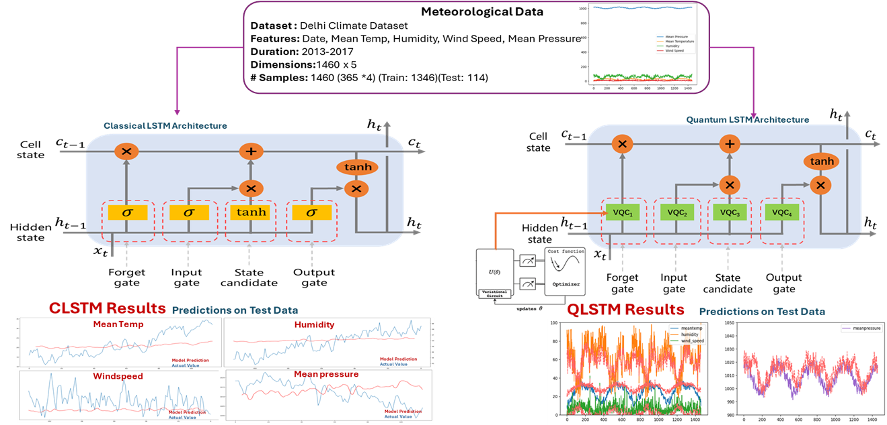
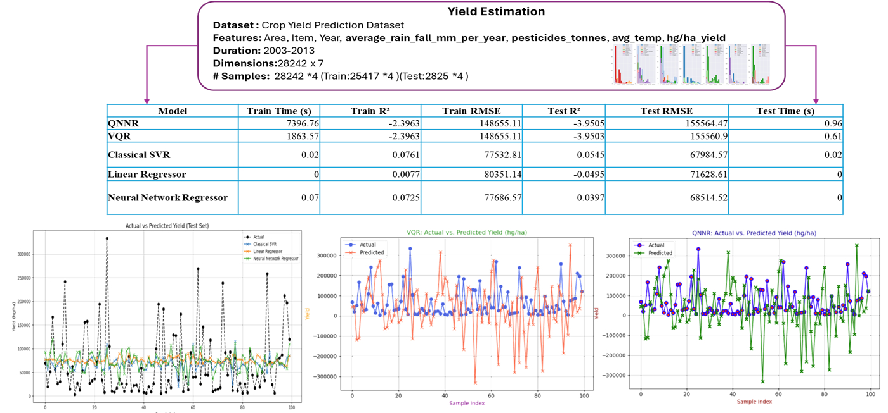

# Quantum Climate Action

Quantum and hybrid quantum–classical machine learning for climate action, benchmarked against classical models on two tasks:

1. **Weather forecasting**: Daily Delhi Climate (2013–2017): mean temperature, humidity, wind speed, mean pressure.
2. **Crop-yield estimation**: Crop Yield Prediction dataset (FAO / World Bank, 101 countries, 10 crops): yield in hg/ha
   from rainfall, pesticides, temperature, crop and country.



## Part 1: Weather Forecasting Models
| Model | Type | Input | Idea |
|---|---|---|---|
| **CLSTM** | classical | 7-day window | standard LSTM, 32 hidden units |
| **QLSTM** | hybrid | 7-day window | LSTM cell whose forget, input, candidate and output gates are **VQC₁–VQC₄** |
| **QNNR** | quantum NN regressor | window → 4 PCA angles | angle-encoded variational circuit, ⟨Z<sub>i</sub>⟩ readout + linear layer |
| **QSVR** | quantum kernel | window → 4 PCA angles | SVR with the ZZ-feature-map fidelity kernel \|⟨φ(x)\|φ(x′)⟩\|² |
| SVR | classical baseline | full window, and the same 4 PCA inputs | RBF SVR |

All models predict all four variables one day ahead and are tested on the same **114 days** (Jan–Apr 2017).
Hyper-parameters (QSVR kernel bandwidth, SVR γ and C) are chosen on the last 20 % of the *training* period,
never on test data.

### QLSTM gate
Each gate g ∈ {f, i, C̃, o} computes `act(W_out · VQC_g(W_in · [h_{t−1}, x_t]))`, where VQC_g encodes 4 inputs with
H, RY(arctan x), RZ(arctan x²), applies 2 layers of CNOT entanglers and trainable RZ-RY-RZ rotations, and measures ⟨Z⟩
on every qubit (Chen et al., *Quantum Long Short-Term Memory*, 2020).

The VQC is simulated exactly in PyTorch (`quantum_layer.py`), so QLSTM trains with ordinary back-propagation. The
simulator is tested against Qiskit's statevector, and `VQCLayer.to_qiskit()` exports the same circuit for IBM hardware.

## Part 2: Crop-Yield Estimation
| Model | Type |
|---|---|
| **QNNR** | hybrid: angle-encoded VQC (⟨Z<sub>i</sub>⟩ readout) + linear layer, trained with Adam |
| **VQR** | pure quantum: ZZ feature map + RealAmplitudes, prediction ∝ ⟨Z…Z⟩, trained with COBYLA |
| Classical SVR, Linear Regressor, Neural Network Regressor | classical baselines |

Inputs: crop and country target encodings (fitted on the training split only), temperature, log rainfall,
log pesticides and year, compressed with PCA to one input per qubit for the quantum models. The target is
log-yield, standardised, so the quantum models' bounded outputs cover the full yield range; metrics are
reported in hg/ha. Split: 90 % train (25,417 rows) / 10 % test (2,825 rows).



## Repository Structure
```
Quantum-Climate-Action/
├── Code/
│   ├── data.py              # loading, pressure-glitch cleaning, scaling, 7-day windows
│   ├── quantum_layer.py     # differentiable VQC (PyTorch statevector) + Qiskit export
│   ├── models.py            # CLSTM, QLSTM (VQC gates)
│   ├── qml_regressors.py    # QSVR, QNNR, classical SVR baselines
│   ├── train.py             # CLSTM vs QLSTM
│   ├── train_qml.py         # QSVR, QNNR, SVR
│   ├── crop_yield.py        # QNNR, VQR vs SVR / linear / MLP on crop yield
│   ├── plot_results.py      # all figures
│   ├── tests/               # simulator vs Qiskit, kernel validity, QNNR learning
│   └── requirements.txt
├── Dataset/                 # Delhi climate train/test CSVs, yield_df.csv
├── Figures/                 # dataset, predictions, RMSE comparison, VQC circuit
│   └── original/            # original project figures (CLSTM/QLSTM, crop-yield QNNR/VQR)
├── Results/                 # metrics JSON, predictions
├── LICENSE
└── README.md
```

## Quick Start
```bash
cd Code
pip install -r requirements.txt
python -m pytest tests
python train.py          # CLSTM vs QLSTM
python train_qml.py      # QSVR, QNNR, SVR
python crop_yield.py     # crop-yield QNNR, VQR and baselines
python plot_results.py
```

## Results
See [Results/README.md](Results/README.md).

## Author
**Wajiha Rahim Khan**  
[Google Scholar](https://scholar.google.com/citations?user=ctvOkbYAAAAJ)

## License
MIT. See [LICENSE](LICENSE).
