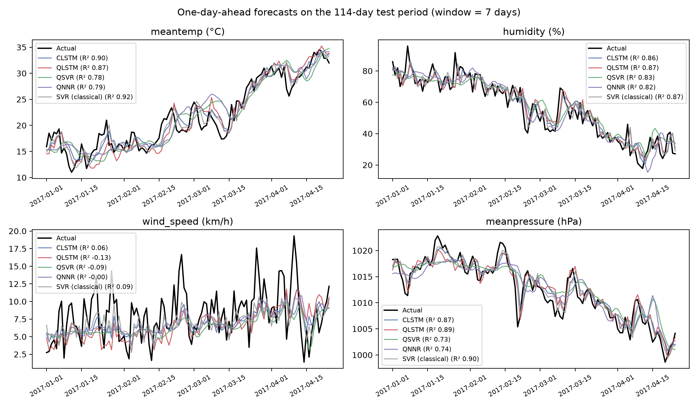
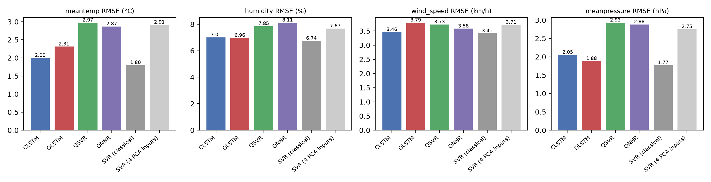
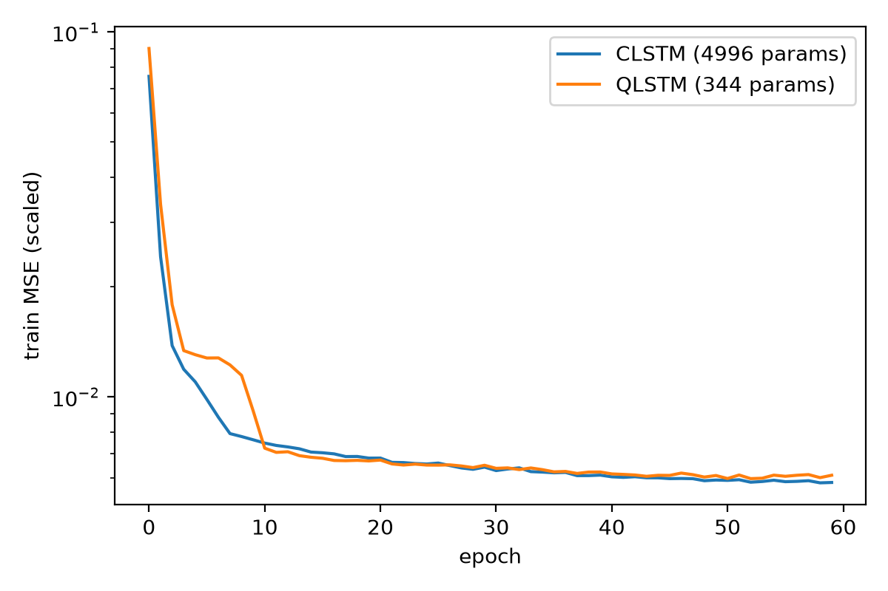
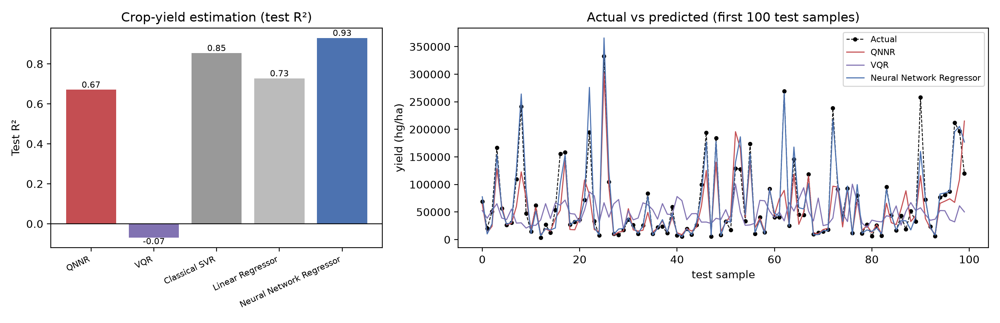

# Results

All numbers below were produced by the code in this repository (exact statevector simulation, seed 42).

## Part 1: Weather forecasting (114-day test period, Jan–Apr 2017)

One-day-ahead prediction of all four variables. **Test R²** (best per column in bold):

| Model | Input | meantemp | humidity | wind_speed | meanpressure |
|---|---|---|---|---|---|
| CLSTM | 7-day window | 0.901 | 0.864 | 0.063 | 0.870 |
| QLSTM | 7-day window | 0.867 | 0.866 | -0.126 | 0.891 |
| QSVR | 4 PCA angles | 0.780 | 0.829 | -0.090 | 0.735 |
| QNNR | 4 PCA angles | 0.795 | 0.817 | -0.005 | 0.743 |
| SVR (classical) | full 7-day window | **0.919** | **0.874** | **0.087** | **0.903** |
| SVR (4 PCA inputs) | 4 PCA inputs | 0.788 | 0.837 | -0.081 | 0.766 |

**Test RMSE** (°C, %, km/h, hPa):

| Model | Input | meantemp | humidity | wind_speed | meanpressure |
|---|---|---|---|---|---|
| CLSTM | 7-day window | 2.00 | 7.01 | 3.46 | 2.05 |
| QLSTM | 7-day window | 2.31 | 6.96 | 3.79 | 1.88 |
| QSVR | 4 PCA angles | 2.97 | 7.85 | 3.73 | 2.93 |
| QNNR | 4 PCA angles | 2.87 | 8.11 | 3.58 | 2.88 |
| SVR (classical) | full 7-day window | 1.80 | 6.74 | 3.41 | 1.77 |
| SVR (4 PCA inputs) | 4 PCA inputs | 2.91 | 7.67 | 3.71 | 2.75 |

Trainable parameters: CLSTM **4,996**, QLSTM **344**, QNNR **68**.

### Observations
- **QLSTM matches CLSTM with ~15× fewer parameters**: it beats CLSTM on humidity and mean pressure and is within
  0.03 R² on temperature.
- **QSVR and QNNR perform on par with a classical SVR given the same 4 PCA inputs.** Compressing the window to
  4 inputs (one per qubit) costs accuracy; the classical SVR on the full window is best overall.
- **QSVR kernel bandwidth matters**: with angles in [0, π] the fidelity kernel is nearly diagonal (validation
  R² ≈ 0.07). A bandwidth of 0.1 (chosen on the last 20 % of the training period) gives validation R² ≈ 0.62.
- Wind speed is close to unpredictable one day ahead for every model (R² ≈ 0).

## Part 2: Crop-yield estimation

25,417 training / 2,825 test rows (random 90 / 10 split). Metrics in hg/ha.

| Model | Train R² | Train RMSE | Test R² | Test RMSE | Train time (s) |
|---|---|---|---|---|---|
| QNNR | 0.676 | 48,349 | 0.671 | 48,951 | 176.67 |
| VQR | -0.103 | 89,184 | -0.070 | 88,230 | 481.89 |
| Classical SVR | 0.857 | 32,085 | 0.854 | 32,577 | 36.95 |
| Linear Regressor | 0.728 | 44,318 | 0.727 | 44,536 | 0.0 |
| Neural Network Regressor | 0.933 | 22,040 | 0.930 | 22,598 | 10.99 |

- With a **log-scaled, standardised target** and crop/country encodings, **QNNR reaches test R² 0.67**
  (the original run with an unscaled target gave R² ≈ −3.95, see `Figures/original/crop_yield_qnnr_vqr.png`).
- **VQR** (pure quantum, single ⟨Z…Z⟩ output, COBYLA on 2,000 samples) is still near R² 0; a hybrid readout (QNNR)
  is much more expressive for this target.
- Classical models remain stronger on this tabular task (MLP R² 0.93).

## Files
| File | Content |
|---|---|
| `results.json` | CLSTM / QLSTM metrics, loss curves, config |
| `results_qml.json` | QSVR / QNNR / SVR metrics, selected hyper-parameters, validation grid |
| `crop_yield_results.json` | crop-yield metrics and timing |
| `predictions.npz`, `predictions_qml.npz`, `crop_yield_predictions.npz` | test-set predictions |
| `qlstm.pt` | trained QLSTM weights |
